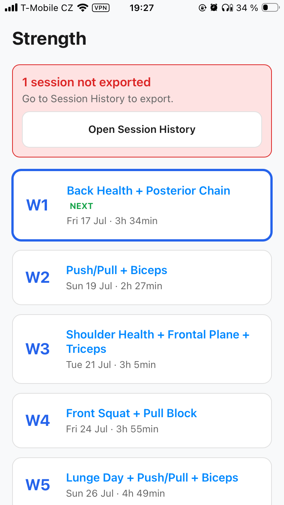

# Roadmap

## Replace "not exported" messages with GitHub backup confirmation

The Home screen currently shows a red "N session(s) not exported — Go to
Session History to export" banner driven by the manual `exported` flag
(`Data.markExported` / `Data.getUnexportedSessions`). Sessions are also
now auto-backed up to GitHub separately (`Data.markBackedUp` /
`Data.getUnbackedSessions`, `Views.backupAllNow`), so the manual-export
messaging is redundant and confusing next to the GitHub backup status.

Idea: replace the manual-export banner/messaging with a GitHub backup
confirmation instead — i.e. base the "your data is safe" signal on
`getUnbackedSessions()` (GitHub) rather than the manual `exported` flag.

